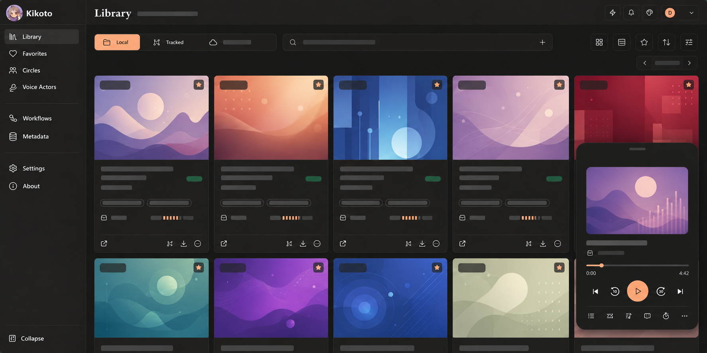

<p align="center">
  
</p>

<h1 align="center">Kikoto</h1>

<p align="center">로컬 우선 개인 오디오 라이브러리, 소스 브라우저 및 플레이어</p>

<p align="center">
  <a href="docs/README.md">문서</a> ·
  릴리스 ·
  <a href="SECURITY.md">보안</a> ·
  <a href="PRIVACY.md">개인정보</a>
</p>

<p align="center">
  <a href="README.md">English</a> ·
  <a href="README.zh-Hans.md">简体中文</a> ·
  <a href="README.zh-Hant.md">繁體中文</a> ·
  <a href="README.ja.md">日本語</a> ·
  <a href="README.ko.md">한국어</a>
</p>

<p align="center">
  
</p>

Kikoto는 DLsite 스타일 메타데이터, 로컬 폴더, 재생성 가능한 Cache, Kikoeru 호환 원격 파일 소스를 하나의 통합 work 모델로 묶습니다. 반응형 플레이어를 갖춘 self-hosted 웹 애플리케이션과 Android 클라이언트를 제공합니다.

> [!IMPORTANT]
> Kikoto는 활발히 개발 중입니다. 업그레이드 전에 `config/`와 `data/`를 백업하고, 네트워크에 인스턴스를 공개하기 전에 [보안 모델](docs/operations/security.md)을 검토하세요.

## 주요 기능

- Local, cached, tracked, remote 파일을 별도 라이브러리 항목이 아닌 하나의 work 가용성 상태로 관리합니다.
- 시작 시 및 파일 시스템 이벤트로 로컬 작품을 검색하고, 필요할 때 metadata Sync를 별도로 실행합니다.
- 원격 소스를 Browse하고 Track, Cache, 검토한 파일의 Fetch를 수행합니다.
- 큐, 가사, 재생 속도, sleep timer, source fallback, Media Session과 PWA를 지원하는 지속 플레이어를 제공합니다.
- 데스크톱과 모바일에서 같은 라이브러리를 사용하고 Android 미디어 컨트롤을 제공합니다.
- Workflows와 Activity에서 백그라운드 작업, 재시도, Review 및 복구를 확인합니다.

## 빠른 시작

### 1. 배포 디렉터리 준비

빈 디렉터리에 [`docker-compose.yml`](docker-compose.yml)을 두고 강력하고 고유한 root 비밀번호를 포함한 `.env`를 만드세요.

```dotenv
KIKOTO_ROOT_PASSWORD=replace-with-a-long-random-password
```

```sh
mkdir config cache data
```

### 2. 로컬 미디어 추가

호스트 `data/` 아래에 지원되는 작품 폴더를 둡니다. [한국어 사용자 가이드](docs/user/ko/index.md)에서 레이아웃과 스캔 규칙을 확인하세요.

### 3. Kikoto 시작

```sh
docker compose up -d --pull always
```

[`.env.example`](.env.example)을 참고해 같은 디렉터리의 `.env`에서 이미지, 관리자 계정, 스캔 깊이, Cookie 보안 설정, 컨테이너 내부 경로를 변경할 수 있습니다. 셸 환경 변수가 `.env`보다 우선합니다. 변경 후 `docker compose up -d`를 실행하세요. 경로 변수는 호스트 마운트 경로를 변경하지 않습니다. 자세한 내용은 [Compose 설정](docs/operations/docker.md#configure-with-env)을 참고하세요.

`docker compose restart`는 현재 컨테이너 이미지를 재사용하며 환경 변수 변경을 적용하지 않습니다. `docker compose up -d`는 Compose 기본 정책에 따라 로컬에 없는 이미지를 가져오고, `latest` 태그는 항상 가져옵니다. 업그레이드할 때는 `--pull always`를 사용하세요. 재현 가능한 배포에는 `.env`의 `KIKOTO_IMAGE`를 검토한 릴리스 tag 또는 image digest로 지정합니다. 업그레이드 전에 `config/`와 `data/`를 백업하세요. 기존 데이터베이스는 시작 시 migration되며 fresh-install baseline으로 재구성되지 않습니다.

<http://127.0.0.1:7655>를 엽니다. 설정한 root 사용자와 `KIKOTO_ROOT_PASSWORD`로 로그인하세요. 운영 Compose는 웹 앱과 API를 호스트 7655 포트에서 함께 제공합니다. 7659는 개발 Compose에서만 별도로 공개됩니다.

기본 매핑은 모든 호스트 인터페이스에서 수신합니다. 외부 네트워크에 노출하지 않으려면 loopback, 신뢰할 수 있는 VPN 또는 보호된 reverse proxy를 사용하세요. 자세한 내용은 [Docker](docs/operations/docker.md)와 [Security](docs/operations/security.md)를 참고하세요.

## 런타임 데이터

| 호스트 경로 | 컨테이너 경로 | 용도 | 백업 |
| --- | --- | --- | --- |
| `./config` | `/config` | SQLite 상태와 첫 실행 소스 설정 | 예 |
| `./data` | `/data` | 원본·Fetch 미디어와 Fetch 검토/롤백 상태 | 예 |
| `./cache` | `/cache` | 재생성 가능한 표지와 미디어 Cache | 보통 아니요 |

런타임 디렉터리를 커밋하지 마세요. 개인 미디어, 계정 상태, 소스 endpoint, 진단 정보 또는 자격 증명이 포함될 수 있습니다.

## 사용자 문서

[한국어 사용자 가이드](docs/user/ko/index.md)는 라이브러리, 원격 소스, 재생, 작품 상세, Workflows와 설정을 설명합니다. 배포와 문제 해결은 [Operations 문서](docs/operations/configuration.md)를 참고하세요.

## 보안 및 개인정보

운영 인스턴스는 기본적으로 로그인이 필요합니다. 익명 접근을 활성화하면 Library 탐색과 재생이 공개되지만 변경과 개인·관리 상태에는 인증이 필요합니다. 취약점은 [SECURITY.md](SECURITY.md)의 비공개 절차로 신고하고, 로그를 공유하기 전에 [PRIVACY.md](PRIVACY.md)를 확인하세요.

## 개발 및 기여

개발 설정, 검증 명령, migration과 릴리스 절차는 [개발 문서](docs/development/)와 [Contributing](CONTRIBUTING.md), [Agent Guide](AGENTS.md)에 있습니다.

## 라이선스

Copyright (C) 2026 yexca. Kikoto는 무보증으로 제공되는 [GNU Affero General Public License v3.0](LICENSE) 소프트웨어입니다.
