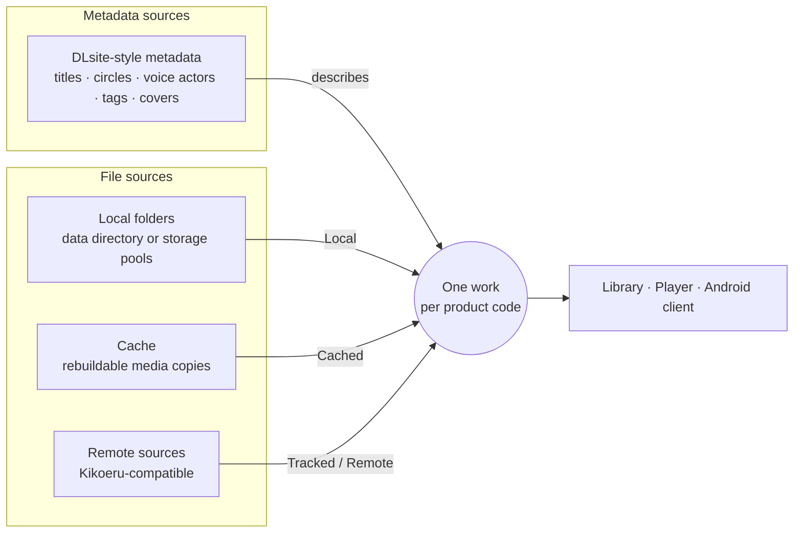

<p align="center">
  
</p>

<h1 align="center">Kikoto</h1>

<p align="center">
  <b>Your purchased audio works, from every folder, cache, and source, in one library.</b><br>
  A local-first, self-hosted audio library, source browser, and player.
</p>

<p align="center">
  <a href="README.md">English</a> ·
  <a href="docs/readme/README.zh-Hans.md">简体中文</a> ·
  <a href="docs/readme/README.zh-Hant.md">繁體中文</a> ·
  <a href="docs/readme/README.ja.md">日本語</a> ·
  <a href="docs/readme/README.ko.md">한국어</a>
</p>

<p align="center">
  <a href="https://github.com/yexca/kikoto/releases"></a>
  <a href="https://kikoto.yexca.net"></a>
  <a href="https://hub.docker.com/r/yexca/kikoto"></a>
  <a href="LICENSE"></a>
</p>

<p align="center">
  <a href="#quick-start">Quick Start</a> ·
  <a href="#highlights">Highlights</a> ·
  <a href="#how-it-works">How It Works</a> ·
  <a href="#documentation">Documentation</a> ·
  <a href="#disclaimer">Disclaimer</a>
</p>

Kikoto brings DLsite-style metadata, local folders, a rebuildable cache, and
Kikoeru-compatible remote file sources together under **one unified work
model**. A work stays a single entry in your library no matter where its files
live. Kikoto runs as a self-hosted web application with a responsive player,
and it has a native Android client.

<p align="center">
  
</p>

> [!NOTE]
> Kikoto is self-hosted software only. It does not provide any service or
> content, and it is designed solely for organizing and listening to DLsite
> works you have purchased yourself. See the [Disclaimer](#disclaimer).

> [!IMPORTANT]
> Kikoto is under active development. Back up `config/` before an upgrade, and
> review the [security model](docs/operations/security.md) before exposing an
> instance to a network.

## Highlights

<table>
  <tr>
    <td width="50%" valign="top">
      <h3>📚 One library, many locations</h3>
      Local, cached, tracked, and remote files are availability states of
      one work, not separate library entries. Use a single data directory
      or mount each disk and cloud drive as its own <b>storage pool</b>.
    </td>
    <td width="50%" valign="top">
      <h3>🔎 Local discovery</h3>
      Scan supported work-code folders and keep local presence current
      through startup and filesystem-triggered workflows. Metadata sync
      runs separately, only when you want enrichment.
    </td>
  </tr>
  <tr>
    <td width="50%" valign="top">
      <h3>🌐 Remote sources</h3>
      Browse compatible sources, <b>Track</b> their directory trees,
      <b>Cache</b> selected media, or <b>Fetch</b> reviewed files into
      your local library.
    </td>
    <td width="50%" valign="top">
      <h3>🎧 Listening continuity</h3>
      A persistent player with queue, lyrics, playback speed, sleep timer,
      source fallback, Media Session, and PWA support. Playback keeps going
      while you navigate.
    </td>
  </tr>
  <tr>
    <td width="50%" valign="top">
      <h3>📱 Responsive and Android-ready</h3>
      The same library on desktop and phone, plus a signed Android client
      with native media controls and audio-focus integration.
    </td>
    <td width="50%" valign="top">
      <h3>🧭 Inspectable background work</h3>
      Follow scans, metadata sync, Fetch, cleanup, retries, and review
      candidates in Workflows and Activity. Resolve metadata and
      missing-source issues in Metadata.
    </td>
  </tr>
  <tr>
    <td colspan="2" valign="top">
      <h3>🗂️ Personal and administrative state</h3>
      Favorites, tags, listening state, playback progress, folder and
      recommendation preferences, roles, source configuration, and cache
      policy all live in one SQLite database.
    </td>
  </tr>
</table>

## How It Works

Metadata sources and file sources are kept separate. Metadata describes a
work; file sources only say where its audio can be found. Both attach to the
same work, identified by its product code.



From a remote source, **Cache** keeps rebuildable copies in `/cache`, and
**Fetch** publishes reviewed files into a local folder. Either way, the files
attach to the existing work instead of creating a new one.

Read more in [Core Boundaries](docs/architecture/core-boundaries.md) and
[ADR-0001: Unified Work Model](docs/decisions/ADR-0001-unified-work-model.md).

## Quick Start

You need Docker with Docker Compose. Windows users can use the
[guided helper](#windows-helper) instead.

**1. Prepare a deployment directory.** Put
[`docker-compose.yml`](docker-compose.yml) in an empty directory and create
the three runtime directories:

```sh
mkdir config cache data
```

**2. Add local media.** Place supported work folders under `data/`. The
[User Guide](docs/user/index.md) explains library layout, scan rules, and
storage pools.

**3. Start Kikoto.**

```sh
docker compose up -d
```

**4. Create the administrator.** Open <http://127.0.0.1:7655>. On first start
Kikoto shows **Set up Kikoto**. Enter the one-time setup token, then choose the
administrator username and password. The token is printed in the service log
and saved as `config/setup-token`:

```sh
docker compose logs kikoto
```

The token works only until the first administrator exists. No password is set
in advance. To define the root account in `.env` instead, set
`KIKOTO_ROOT_ACCOUNT_MODE=environment` with `KIKOTO_ROOT_PASSWORD`. For both
options and resetting a forgotten password, see
[Administrator setup and recovery](docs/operations/security.md#administrator-setup-and-recovery).

**5. Set up your library.** After sign-in, **Set up your library** lets you
choose a standard or storage-pool layout, run the first scan, and optionally
start metadata sync. See [Getting Started](docs/user/en/getting-started.md#first-library-setup).

> [!WARNING]
> The default port mapping listens on every host interface. Bind it to
> loopback, use a trusted VPN, or configure a protected reverse proxy when the
> instance should not be reachable from the surrounding network. See
> [Docker](docs/operations/docker.md) and
> [Security](docs/operations/security.md) for deployment options, including the
> isolated read-only Demo stack.

The production Compose stack serves the web application and API on the same
host port, `7655`. Port `7659` is exposed separately only by the development
stack. Production instances require sign-in by default; a super administrator
can optionally enable read-only anonymous Library browsing and playback under
`Maintenance -> Access`.

Signed Android APKs are attached to each
[GitHub Release](https://github.com/yexca/kikoto/releases).

### Optional settings

Use [`.env.example`](.env.example) for optional settings, including the image,
scan depth, cookie security, and container paths. Compose reads `.env`
automatically; shell environment variables take precedence. See
[Compose configuration](docs/operations/docker.md#configure-with-env) for
defaults and how to apply changes.

### Windows helper

On Windows, place [`kikoto-helper.cmd`](kikoto-helper/kikoto-helper.cmd) in a
deployment folder and run it. It guides you through setup in English or
Simplified Chinese.

<details>
<summary>What the helper does</summary>

<br>

The first screen selects English or Simplified Chinese and downloads only the
selected language helper beside the command file. It then checks Docker
Desktop, downloads the current Compose files, creates the runtime directories,
supports browser administrator setup, manages additional media-folder
mappings, and provides start, stop, upgrade, status, logs, and
configuration-backup actions. Existing `.env` and Compose files are kept on
re-runs; legacy Compose account settings are updated with copies of the
original files saved first.

The helper automatically prepares missing deployment files. New installations
create the administrator in the browser without an `.env` password. Existing
helper-managed accounts retain environment mode; their password changes can
recreate the service to apply the new configuration. Restarting alone does not
reload `.env`. Upgrade and Backup save `config/` and deployment settings
outside the deployment directory; mounted `data/` is not copied. Service
management also offers explicit recreation, container removal, and the local
image version. Removing containers keeps host-mounted files.

Folder management requires Docker Compose 2.24.4 or newer. Single-folder mode
mounts the selected directory at `/data`. Multiple-folder mode keeps the host
`data/` mount at `/data` for downloads and mounts only the selected directories
below it; it creates no persistent volume. The “Other → Multiple-folder repair”
action restores that host mount for deployments created by older helper
versions.

</details>

## Runtime Data

| Host path | Container path | Purpose | Back up? |
| --- | --- | --- | --- |
| `./config` | `/config` | SQLite state and optional first-run source configuration | Yes |
| `./data` | `/data` | Original media, fetched media, and durable Fetch review/rollback state | Yes |
| `./cache` | `/cache` | Rebuildable covers and media cache | Usually no |

Do not commit any of these runtime directories. They may contain private media,
account state, source endpoints, workflow diagnostics, or credentials.

## Upgrading

Back up `config/` before upgrading and keep the existing `data/` mount. Then
run:

```sh
docker compose up -d
```

`docker compose up -d` uses Compose's default pull policy, which pulls missing
images and always pulls the `latest` tag. `docker compose restart` reuses the
current container image. For a reproducible deployment, set `KIKOTO_IMAGE` in
`.env` to a reviewed release tag or image digest and update it deliberately
during an upgrade. Existing databases are migrated on startup and are never
rebuilt from the fresh-install baseline. See [Upgrade](docs/operations/docker.md#upgrade)
and the [release history](docs/history/index.md).

> [!NOTE]
> **Custom workflow editing has been removed.** Workflows are now built-in
> presets (Follow a circle, Follow a series, Follow a voice actor). When an
> older database upgrades through migration 035, Kikoto saves user-authored
> definitions and triggers for review. Exact preset matches can be converted
> to disabled triggers; other definitions can be exported. Run history remains
> readable in Activity. Instances that already passed migration 035 need an
> older database backup to recover definitions deleted before this change.

## Documentation

| Goal | Start here |
| --- | --- |
| Use Kikoto: library, sources, playback, workflows, settings | [User Guide](docs/user/index.md) |
| Install and scan a first library | [Getting Started](docs/user/en/getting-started.md) |
| Understand user-visible behavior | [Product Specs](docs/user/en/index.md) |
| Configure and operate an instance | [Operations](docs/operations/configuration.md) |
| Understand data and system boundaries | [Architecture](docs/architecture/index.md) |
| Review design and security contracts | [Design](docs/development/design.md) · [Security](SECURITY.md) · [Privacy](PRIVACY.md) |
| Find every public document | [Documentation Index](docs/README.md) |

## Development and Contributing

Development setup, validation commands, migrations, and release procedures
live under `docs/development/`, so this README can stay focused on
installation and product behavior.

- [Local Development](docs/development/local-dev.md)
- [Testing](docs/development/testing.md)
- [Contributing](CONTRIBUTING.md)
- [Agent Guide](AGENTS.md)

## Security and Privacy

Production instances require sign-in by default. When a super administrator
enables anonymous access, Library browsing and playback become intentionally
public to anyone who can reach the instance; mutations and personal or
administrative state still require authentication. Use network controls when
the collection itself must remain private. Report a suspected vulnerability
through the private process in [SECURITY.md](SECURITY.md) and review
[PRIVACY.md](PRIVACY.md) before sharing logs or diagnostics.

## Disclaimer

- Kikoto is software only. The project does not operate a store, streaming,
  or content service, and it does not host, sell, provide, or distribute audio
  works, metadata, or media files.
- Kikoto is designed only for organizing and playing DLsite works that you
  have personally purchased. Use it with media you are entitled to, and follow
  the terms of the stores and sources you connect.
- The public demo exists only to demonstrate the software and shows only
  all-ages, permanently free works.
- Kikoto is an independent project and is not affiliated with or endorsed by
  DLsite or Kikoeru. Their names are used only to describe compatibility.
- Each instance is operated by its owner, who is responsible for the sources
  it is configured to use and the files added to it.

## License

Copyright (C) 2026 yexca. Kikoto is free software licensed under the
[GNU Affero General Public License v3.0](LICENSE) and comes without warranty.
