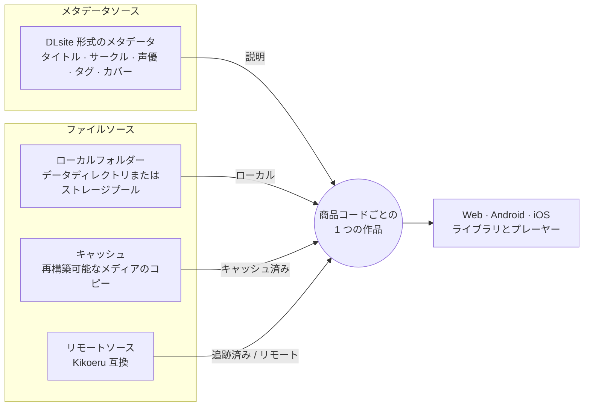

<p align="center">
  <a href="../../README.md">English</a> ·
  <a href="README.zh-Hans.md">简体中文</a> ·
  <a href="README.zh-Hant.md">繁體中文</a> ·
  <a href="README.ja.md">日本語</a> ·
  <a href="README.ko.md">한국어</a>
</p>

<p align="center">
  
</p>

<h1 align="center">Kikoto</h1>

<p align="center">
  <b>購入した音声作品を、あらゆるフォルダー、キャッシュ、ソースから、ひとつのライブラリへ。</b><br>
  ローカル優先のセルフホスト型オーディオライブラリ、ソースブラウザー、プレーヤーです。
</p>

<p align="center">
  <a href="https://github.com/yexca/kikoto/releases"></a>
  <a href="https://kikoto.yexca.net"></a>
  <a href="https://hub.docker.com/r/yexca/kikoto"></a>
  <a href="../../LICENSE"></a>
</p>

<p align="center">
  <a href="#主な特長">主な特長</a> ·
  <a href="#動作環境">動作環境</a> ·
  <a href="#仕組み">仕組み</a> ·
  <a href="#クイックスタート">クイックスタート</a> ·
  <a href="#ドキュメント">ドキュメント</a> ·
  <a href="#免責事項">免責事項</a>
</p>

Kikoto は、DLsite 形式のメタデータ、ローカルフォルダー、再構築可能なキャッシュ、Kikoeru 互換のリモートファイルソースを、**統一された 1 つの作品モデル** のもとにまとめます。ファイルがどこにあっても、作品はライブラリ内の 1 つの項目のままです。Kikoto は、常駐型のプレーヤーを備えたセルフホスト型の Web アプリケーションとして動作し、同じライブラリをデスクトップブラウザー、タブレット、Android アプリ、iOS アプリで開けます。

<p align="center">
  
</p>

> [!NOTE]
> Kikoto はセルフホスト型のソフトウェアにすぎません。サービスやコンテンツを一切提供せず、ご自身で購入した DLsite の作品を整理して聴くためだけに設計されています。[免責事項](#免責事項)を参照してください。

> [!IMPORTANT]
> Kikoto は活発に開発中です。アップグレードの前に `config/` をバックアップし、インスタンスをネットワークに公開する前に[セキュリティモデル](../operations/security.md)を確認してください。

## 主な特長

<table>
  <tr>
    <td width="50%" valign="top">
      <h3>📚 1 つのライブラリ、複数の場所</h3>
      ローカル、キャッシュ、追跡済み、リモートのファイルは、別々のライブラリ項目ではなく、1 つの作品の利用可能状態です。1 つのデータディレクトリを使うことも、各ディスクやクラウドドライブをそれぞれ独立した<b>ストレージプール</b>としてマウントすることもできます。
    </td>
    <td width="50%" valign="top">
      <h3>🌐 リモートソース</h3>
      互換性のあるソースを閲覧し、そのディレクトリツリーを<b>追跡（Track）</b>し、選択したメディアを<b>キャッシュ（Cache）</b>し、確認済みのファイルをローカルライブラリへ<b>取得（Fetch）</b>できます。リモート操作には専用の権限があります。
    </td>
  </tr>
  <tr>
    <td width="50%" valign="top">
      <h3>🏷️ 使用言語に合わせたメタデータ</h3>
      タイトル、共有タグ、サークル、声優は言語ごとの名前を持ち、ユーザーごとに優先するメタデータ言語を選べます。編集者は、作品ごとにタイトル、カバー、タグ、クレジットを修正できます。
    </td>
    <td width="50%" valign="top">
      <h3>🔎 ローカルでの検出</h3>
      対応する作品コードのフォルダーをスキャンし、起動時とファイルシステムをきっかけとするワークフローで、ローカルの存在状態を最新に保ちます。メタデータの同期は別に実行され、補完したいときにだけ行われます。
    </td>
  </tr>
  <tr>
    <td width="50%" valign="top">
      <h3>🎧 途切れない聴取体験</h3>
      キュー、再生速度、スリープタイマー、ソースのフォールバック、Media Session に対応した常駐型のプレーヤーです。進捗はアカウントに紐付いて端末間で引き継がれ、聴取ダッシュボードには、合計時間、連続日数、よく再生した作品が表示されます。
    </td>
    <td width="50%" valign="top">
      <h3>💬 歌詞</h3>
      LRC、WebVTT、SRT の歌詞が、プレーヤーと画面上の歌詞ウィンドウで再生に合わせて表示されます。<b>歌詞を管理</b>では、トラックごとに歌詞ファイルを割り当てられ、リモートソースから歌詞をダウンロードすることもできます。
    </td>
  </tr>
  <tr>
    <td width="50%" valign="top">
      <h3>✨ 理由が読めるおすすめ</h3>
      スコアは、お気に入りと聴取履歴をもとにご自身のインスタンス上で計算され、ローカルとリモートの作品に表示されます。スコアごとにその理由も確認できます。
    </td>
    <td width="50%" valign="top">
      <h3>🧭 確認できるバックグラウンド処理</h3>
      スキャン、メタデータ同期、Fetch、可用性ウォッチ、クリーンアップ、再試行、レビュー候補を、ワークフローとアクティビティで追跡できます。メタデータの問題とソース欠落の問題は、メタデータで解決します。
    </td>
  </tr>
  <tr>
    <td colspan="2" valign="top">
      <h3>🗂️ アカウント、ロール、1 つのデータベース</h3>
      ユーザー、コントリビューター、管理者、スーパー管理者のロールによって、閲覧、取得、編集、管理ができる人が決まります。お気に入り、タグ、聴取状態、再生の進捗、設定、ソースの設定、キャッシュのポリシーは、すべて 1 つの SQLite データベースに保存されます。
    </td>
  </tr>
</table>

## 動作環境

1 台のサーバーがすべての画面に対応し、ページを移動してもプレーヤーは再生を続けます。

| 環境 | 利用できる機能 |
| --- | --- |
| **ワイド Web**（デスクトップブラウザー） | 完全なレイアウトです。サイドバーナビゲーション、複数列のライブラリ、トラック一覧の横にフォルダーエクスプローラーを備えた作品詳細を利用できます。 |
| **ナロー Web**（タブレットまたは小さいウィンドウ） | タッチ操作向けのコントロールを備えた、コンパクトなレイアウトで同じページを表示します。Web アプリは PWA としてインストールできます。 |
| **Android** | 署名付きの APK です。メディア通知、フローティング歌詞、オーディオフォーカスの処理、アプリロックを含むデバイスのプライバシー制御に対応します。 |
| **iOS** | サイドロード用の署名されていない IPA です。Picture-in-Picture の歌詞、端からのスワイプで戻る操作、Keychain に保存されるセッション、デバイスのプライバシー制御に対応します。 |

APK と IPA は、各 [GitHub Release](https://github.com/yexca/kikoto/releases) に添付されています。iOS にインストールするには、サイドロード用ツールで IPA をご自身の Apple アカウントで再署名する必要があります。どちらのアプリも、ご自身の Kikoto サーバーに接続します。詳しくは[はじめに](../user/ja/getting-started.md#android-クライアント)を参照してください。

## 仕組み

メタデータソースとファイルソースは分けて管理されます。メタデータは作品を説明し、ファイルソースは、その音声がどこにあるかを示すだけです。どちらも、商品コードで識別される同じ作品に紐付けられます。



リモートソースからは、**キャッシュ（Cache）** が再構築可能なコピーを `/cache` に保持し、**取得（Fetch）** が確認済みのファイルをローカルフォルダーに公開します。どちらの場合も、ファイルは新しい作品を作成するのではなく、既存の作品に紐付けられます。

詳しくは、[コアの境界](../architecture/core-boundaries.md)と [ADR-0001: Unified Work Model](../decisions/ADR-0001-unified-work-model.md) を参照してください。

## クイックスタート

Docker と Docker Compose が必要です。Windows ユーザーは、代わりに[ガイド付きヘルパー](#windows-ヘルパー)を使用できます。

**1. デプロイ用ディレクトリを準備します。** 空のディレクトリに [`docker-compose.yml`](../../docker-compose.yml) を置き、3 つのランタイムディレクトリを作成します。

```sh
mkdir config cache data
```

**2. ローカルのメディアを追加します。** 対応する作品フォルダーを `data/` の下に置きます。ライブラリのレイアウト、スキャンのルール、ストレージプールについては、[ユーザーガイド](../user/ja/index.md)で説明しています。

**3. Kikoto を起動します。**

```sh
docker compose up -d
```

**4. 管理者を作成します。** <http://127.0.0.1:7655> を開きます。初回起動時、Kikoto には **Kikoto のセットアップ** が表示されます。1 回限りのセットアップトークンを入力し、管理者のユーザー名とパスワードを選択します。トークンはサービスのログに出力され、`config/setup-token` にも保存されます。

```sh
docker compose logs kikoto
```

このトークンは、最初の管理者が作成されるまでのみ有効です。事前に設定されるパスワードはありません。代わりに root アカウントを `.env` で定義するには、`KIKOTO_ROOT_ACCOUNT_MODE=environment` と `KIKOTO_ROOT_PASSWORD` を設定します。両方のオプションと、忘れたパスワードのリセットについては、[管理者のセットアップとリカバリー](../operations/security.md#administrator-setup-and-recovery)を参照してください。

**5. ライブラリを設定します。** サインイン後、**ライブラリを設定** で、標準またはストレージプールのレイアウトを選択し、最初のスキャンを実行し、必要に応じてメタデータ同期を開始できます。[はじめに](../user/ja/getting-started.md#最初のライブラリ設定)を参照してください。

> [!WARNING]
> 既定のポートマッピングは、すべてのホストインターフェースで待ち受けます。インスタンスを周囲のネットワークから到達できないようにしたい場合は、ループバックにバインドするか、信頼できる VPN を使用するか、保護されたリバースプロキシを設定してください。分離された読み取り専用のデモスタックを含むデプロイのオプションについては、[Docker](../operations/docker.md) と[セキュリティ](../operations/security.md)を参照してください。

本番用の Compose スタックは、Web アプリケーションと API を同じホストポート `7655` で提供します。ポート `7659` は、開発用スタックでのみ個別に公開されます。本番のインスタンスは既定でサインインが必要です。スーパー管理者は、`設定 -> ユーザー -> インスタンスアクセス` で、読み取り専用の匿名でのライブラリ閲覧と再生を任意で有効にできます。

### 任意の設定

イメージ、スキャン深度、Cookie のセキュリティ、コンテナ内のパスなど、任意の設定には [`.env.example`](../../.env.example) を使用してください。Compose は `.env` を自動的に読み込み、シェルの環境変数が優先されます。既定値と変更の適用方法については、[Compose の設定](../operations/docker.md#configure-with-env)を参照してください。

### Windows ヘルパー

Windows では、[`kikoto-helper.cmd`](../../kikoto-helper/kikoto-helper.cmd) をデプロイ用フォルダーに置いて実行してください。英語または簡体字中国語でセットアップを案内します。

<details>
<summary>ヘルパーの機能</summary>

<br>

最初の画面で英語または簡体字中国語を選択すると、選択した言語のヘルパーだけがコマンドファイルの隣にダウンロードされます。その後、Docker Desktop を確認し、現在の Compose ファイルをダウンロードし、ランタイムディレクトリを作成します。ブラウザーでの管理者セットアップに対応し、追加のメディアフォルダーのマッピングを管理し、開始、停止、アップグレード、ステータス、ログ、設定のバックアップの各操作を提供します。再実行しても既存の `.env` と Compose ファイルは保持されます。従来の Compose のアカウント設定は、元のファイルのコピーを先に保存してから更新されます。

ヘルパーは、不足しているデプロイ用ファイルを自動的に準備します。新規インストールでは、`.env` のパスワードなしで、ブラウザーから管理者を作成します。ヘルパーが管理している既存のアカウントは環境モードを維持し、そのパスワードを変更すると、新しい設定を適用するためにサービスが再作成されることがあります。再起動だけでは `.env` は再読み込みされません。アップグレードとバックアップでは、`config/` とデプロイの設定がデプロイ用ディレクトリの外に保存され、マウントされた `data/` はコピーされません。サービス管理では、明示的な再作成、コンテナの削除、ローカルのイメージバージョンも利用できます。コンテナを削除しても、ホストにマウントされたファイルは保持されます。

フォルダー管理には、Docker Compose 2.24.4 以降が必要です。単一フォルダーモードでは、選択したディレクトリが `/data` にマウントされます。複数フォルダーモードでは、ダウンロード用にホストの `data/` マウントを `/data` に維持し、その配下の選択したディレクトリのみをマウントします。永続的なボリュームは作成しません。“Other → Multiple-folder repair” の操作で、古いヘルパーのバージョンで作成されたデプロイに対して、そのホストのマウントが復元されます。

</details>

## ランタイムデータ

| ホストのパス | コンテナのパス | 用途 | バックアップ |
| --- | --- | --- | --- |
| `./config` | `/config` | SQLite の状態と、任意の初回起動時のソース設定 | 必要 |
| `./data` | `/data` | 元のメディア、取得したメディア、永続的な Fetch のレビュー／ロールバックの状態 | 必要 |
| `./cache` | `/cache` | 再構築可能なカバーとメディアキャッシュ | 通常は不要 |

これらのランタイムディレクトリは、コミットしないでください。個人のメディア、アカウントの状態、ソースのエンドポイント、ワークフローの診断情報、認証情報が含まれている場合があります。

## アップグレード

アップグレードの前に `config/` をバックアップし、既存の `data/` マウントを維持してください。その後、次を実行します。

```sh
docker compose up -d
```

`docker compose up -d` は Compose の既定のプルポリシーを使用し、存在しないイメージを取得して、`latest` タグは常に取得します。`docker compose restart` は現在のコンテナイメージを再利用します。再現可能なデプロイを行うには、`.env` の `KIKOTO_IMAGE` を、確認済みのリリースタグまたはイメージダイジェストに設定し、アップグレード時に意図的に更新してください。既存のデータベースは起動時に移行され、新規インストール用のベースラインから再構築されることはありません。[アップグレード](../operations/docker.md#upgrade)と[リリース履歴](../history/index.md)を参照してください。

## ドキュメント

| 目的 | 最初に読むもの |
| --- | --- |
| Kikoto を使う: ライブラリ、ソース、再生、ワークフロー、設定 | [ユーザーガイド](../user/ja/index.md) |
| インストールして最初のライブラリをスキャンする | [はじめに](../user/ja/getting-started.md) |
| ユーザーに見える動作を理解する | [製品仕様](../user/ja/index.md) |
| インスタンスを構成して運用する | [運用](../operations/configuration.md) |
| データとシステムの境界を理解する | [アーキテクチャ](../architecture/index.md) |
| 設計とセキュリティの規約を確認する | [設計](../development/design.md) · [セキュリティ](../../SECURITY.md) · [プライバシー](../../PRIVACY.md) |
| すべての公開ドキュメントを探す | [ドキュメントインデックス](../README.md) |

## 開発とコントリビューション

開発環境のセットアップ、検証コマンド、マイグレーション、リリース手順は `docs/development/` にあるため、この README はインストールと製品の動作に集中できます。

- [ローカル開発](../development/local-dev.md)
- [テスト](../development/testing.md)
- [コントリビューション](../../CONTRIBUTING.md)
- [エージェントガイド](../../AGENTS.md)

## セキュリティとプライバシー

本番のインスタンスは既定でサインインが必要です。スーパー管理者が匿名アクセスを有効にすると、ライブラリの閲覧と再生は、インスタンスに到達できるすべての人に意図的に公開されます。変更操作と、個人または管理上の状態には、引き続き認証が必要です。コレクション自体を非公開にしておく必要がある場合は、ネットワークの制御を使用してください。脆弱性の疑いは、[SECURITY.md](../../SECURITY.md) の非公開の手順で報告し、ログや診断情報を共有する前に [PRIVACY.md](../../PRIVACY.md) を確認してください。

## 免責事項

- Kikoto はソフトウェアのみです。このプロジェクトは、ストア、ストリーミング、コンテンツサービスを運営せず、音声作品、メタデータ、メディアファイルのホスティング、販売、提供、配布を行いません。
- Kikoto は、ご自身で購入した DLsite の作品を整理して再生するためだけに設計されています。利用する権利のあるメディアで使用し、接続するストアやソースの利用規約に従ってください。
- 公開デモはソフトウェアのデモンストレーションのためだけに存在し、全年齢向けで恒久的に無料の作品のみを表示します。
- Kikoto は独立したプロジェクトであり、DLsite や Kikoeru と提携しておらず、承認も受けていません。これらの名称は、互換性を説明するためにのみ使用しています。
- 各インスタンスはその所有者が運用し、所有者は、設定したソースと、追加したファイルについて責任を負います。

## ライセンス

Copyright (C) 2026 yexca. Kikoto は [GNU Affero General Public License v3.0](../../LICENSE) の下でライセンスされるフリーソフトウェアであり、無保証です。
