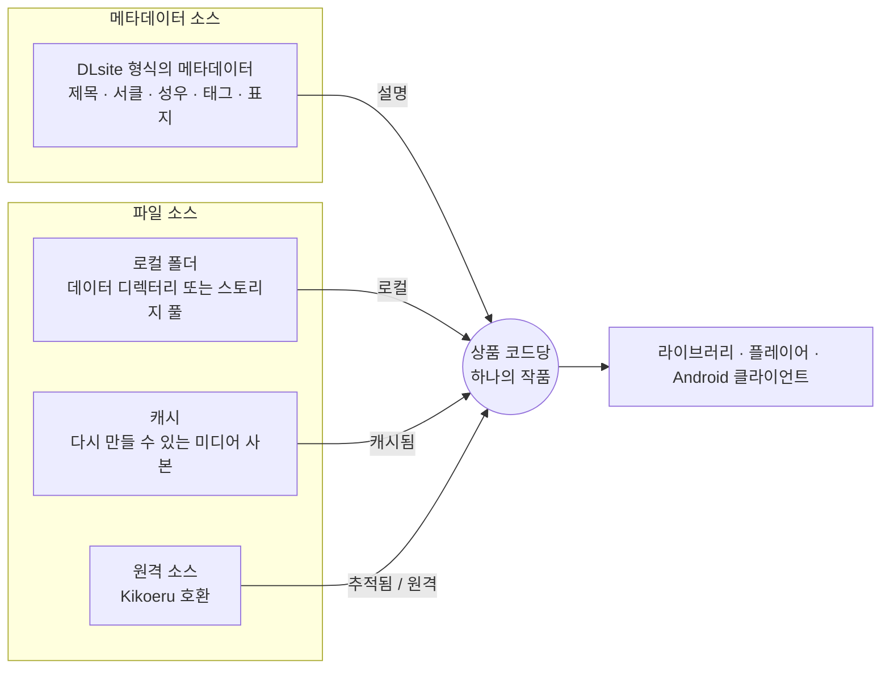

<p align="center">
  <a href="../../README.md">English</a> ·
  <a href="README.zh-Hans.md">简体中文</a> ·
  <a href="README.zh-Hant.md">繁體中文</a> ·
  <a href="README.ja.md">日本語</a> ·
  <a href="README.ko.md">한국어</a>
</p>

<p align="center">
  
</p>

<h1 align="center">Kikoto</h1>

<p align="center">
  <b>구매한 음성 작품을 모든 폴더, 캐시, 소스에서 하나의 라이브러리로.</b><br>
  로컬 우선의 셀프 호스팅 오디오 라이브러리, 소스 브라우저, 플레이어입니다.
</p>

<p align="center">
  <a href="https://github.com/yexca/kikoto/releases"></a>
  <a href="https://kikoto.yexca.net"></a>
  <a href="https://hub.docker.com/r/yexca/kikoto"></a>
  <a href="../../LICENSE"></a>
</p>

<p align="center">
  <a href="#빠른-시작">빠른 시작</a> ·
  <a href="#주요-특징">주요 특징</a> ·
  <a href="#작동-방식">작동 방식</a> ·
  <a href="#문서">문서</a> ·
  <a href="#면책-조항">면책 조항</a>
</p>

Kikoto는 DLsite 형식의 메타데이터, 로컬 폴더, 다시 만들 수 있는 캐시, Kikoeru 호환 원격 파일 소스를 **하나의 통합 작품 모델** 아래 모읍니다. 파일이 어디에 있든 작품은 라이브러리에서 하나의 항목으로 유지됩니다. Kikoto는 반응형 플레이어를 갖춘 셀프 호스팅 웹 애플리케이션으로 실행되며, 네이티브 Android 클라이언트도 제공합니다.

<p align="center">
  
</p>

> [!NOTE]
> Kikoto는 셀프 호스팅 소프트웨어일 뿐입니다. 어떠한 서비스나 콘텐츠도 제공하지 않으며, 사용자가 직접 구매한 DLsite 작품을 정리하고 듣는 용도로만 설계되었습니다. [면책 조항](#면책-조항)을 참고하세요.

> [!IMPORTANT]
> Kikoto는 활발히 개발 중입니다. 업그레이드하기 전에 `config/`를 백업하고, 인스턴스를 네트워크에 공개하기 전에 [보안 모델](../operations/security.md)을 검토하세요.

## 주요 특징

<table>
  <tr>
    <td width="50%" valign="top">
      <h3>📚 하나의 라이브러리, 여러 위치</h3>
      로컬, 캐시, 추적, 원격 파일은 별개의 라이브러리 항목이 아니라 하나의 작품이 가진 사용 가능 상태입니다. 단일 데이터 디렉터리를 사용하거나, 디스크와 클라우드 드라이브를 각각 별도의 <b>스토리지 풀</b>로 마운트할 수 있습니다.
    </td>
    <td width="50%" valign="top">
      <h3>🔎 로컬 탐색</h3>
      지원되는 작품 코드 폴더를 스캔하고, 시작 시 및 파일 시스템 변경으로 실행되는 워크플로로 로컬 존재 여부를 최신 상태로 유지합니다. 메타데이터 동기화는 별도로 실행되며, 보강이 필요할 때만 실행됩니다.
    </td>
  </tr>
  <tr>
    <td width="50%" valign="top">
      <h3>🌐 원격 소스</h3>
      호환되는 소스를 탐색하고, 디렉터리 트리를 <b>추적(Track)</b>하거나, 선택한 미디어를 <b>캐시(Cache)</b>하거나, 검토를 마친 파일을 로컬 라이브러리로 <b>가져오기(Fetch)</b>할 수 있습니다.
    </td>
    <td width="50%" valign="top">
      <h3>🎧 끊김 없는 청취</h3>
      대기열, 가사, 재생 속도, 취침 타이머, 소스 대체, Media Session, PWA를 지원하는 지속형 플레이어입니다. 화면을 이동해도 재생이 계속됩니다.
    </td>
  </tr>
  <tr>
    <td width="50%" valign="top">
      <h3>📱 반응형, 그리고 Android 지원</h3>
      데스크톱과 휴대폰에서 같은 라이브러리를 사용할 수 있으며, 네이티브 미디어 컨트롤과 오디오 포커스 연동을 갖춘 서명된 Android 클라이언트도 제공합니다.
    </td>
    <td width="50%" valign="top">
      <h3>🧭 확인할 수 있는 백그라운드 작업</h3>
      스캔, 메타데이터 동기화, Fetch, 정리, 재시도, 검토 후보를 워크플로와 활동에서 따라가세요. 메타데이터 문제와 소스 누락 문제는 메타데이터에서 해결합니다.
    </td>
  </tr>
  <tr>
    <td colspan="2" valign="top">
      <h3>🗂️ 개인 상태와 관리 상태</h3>
      즐겨찾기, 태그, 청취 상태, 재생 진행 상황, 폴더 및 추천 환경설정, 역할, 소스 구성, 캐시 정책이 모두 하나의 SQLite 데이터베이스에 저장됩니다.
    </td>
  </tr>
</table>

## 작동 방식

메타데이터 소스와 파일 소스는 분리되어 있습니다. 메타데이터는 작품을 설명하고, 파일 소스는 오디오를 어디에서 찾을 수 있는지만 알려 줍니다. 둘 다 상품 코드로 식별되는 같은 작품에 연결됩니다.



원격 소스에서 **캐시(Cache)**는 다시 만들 수 있는 사본을 `/cache`에 보관하고, **가져오기(Fetch)**는 검토를 마친 파일을 로컬 폴더에 게시합니다. 어느 쪽이든 파일은 새 작품을 만들지 않고 기존 작품에 연결됩니다.

자세한 내용은 [핵심 경계](../architecture/core-boundaries.md)와 [ADR-0001: Unified Work Model](../decisions/ADR-0001-unified-work-model.md)을 참고하세요.

## 빠른 시작

Docker와 Docker Compose가 필요합니다. Windows 사용자는 대신 [안내형 도우미](#windows-도우미)를 사용할 수 있습니다.

**1. 배포 디렉터리를 준비합니다.** 빈 디렉터리에 [`docker-compose.yml`](../../docker-compose.yml)을 두고 세 개의 런타임 디렉터리를 만듭니다.

```sh
mkdir config cache data
```

**2. 로컬 미디어를 추가합니다.** 지원되는 작품 폴더를 `data/` 아래에 둡니다. 라이브러리 구성, 스캔 규칙, 스토리지 풀은 [사용자 가이드](../user/ko/index.md)에서 설명합니다.

**3. Kikoto를 시작합니다.**

```sh
docker compose up -d
```

**4. 관리자를 만듭니다.** <http://127.0.0.1:7655>를 엽니다. 처음 시작하면 Kikoto에 **Kikoto 설정**이 표시됩니다. 일회용 설정 토큰을 입력한 다음 관리자 사용자 이름과 비밀번호를 정하세요. 토큰은 서비스 로그에 출력되며 `config/setup-token`으로도 저장됩니다.

```sh
docker compose logs kikoto
```

이 토큰은 첫 번째 관리자가 만들어질 때까지만 유효합니다. 미리 설정되는 비밀번호는 없습니다. 대신 `.env`에서 root 계정을 정의하려면 `KIKOTO_ROOT_ACCOUNT_MODE=environment`와 `KIKOTO_ROOT_PASSWORD`를 설정하세요. 두 가지 방법과 잊어버린 비밀번호의 재설정은 [관리자 설정 및 복구](../operations/security.md#administrator-setup-and-recovery)를 참고하세요.

**5. 라이브러리를 설정합니다.** 로그인하면 **라이브러리 설정**에서 표준 또는 스토리지 풀 레이아웃을 선택하고, 첫 스캔을 실행하고, 원한다면 메타데이터 동기화를 시작할 수 있습니다. [시작하기](../user/ko/getting-started.md#라이브러리-처음-설정)를 참고하세요.

> [!WARNING]
> 기본 포트 매핑은 모든 호스트 인터페이스에서 수신 대기합니다. 주변 네트워크에서 인스턴스에 접근할 수 없어야 한다면 루프백에 바인딩하거나, 신뢰할 수 있는 VPN을 사용하거나, 보호된 리버스 프록시를 구성하세요. 격리된 읽기 전용 데모 스택을 포함한 배포 옵션은 [Docker](../operations/docker.md)와 [보안](../operations/security.md)을 참고하세요.

프로덕션 Compose 스택은 웹 애플리케이션과 API를 같은 호스트 포트인 `7655`로 제공합니다. `7659` 포트는 개발용 스택에서만 별도로 노출됩니다. 프로덕션 인스턴스는 기본적으로 로그인이 필요하며, 슈퍼 관리자는 `설정 -> 사용자 -> 인스턴스 접근`에서 읽기 전용 익명 라이브러리 탐색과 재생을 선택적으로 켤 수 있습니다.

서명된 Android APK와 서명되지 않은 iOS IPA는 각 [GitHub Release](https://github.com/yexca/kikoto/releases)에 첨부됩니다. iOS에서 설치하려면 사이드로딩 도구로 IPA를 다시 서명해야 합니다.

### 선택 설정

이미지, 스캔 깊이, 쿠키 보안, 컨테이너 경로 등 선택 설정에는 [`.env.example`](../../.env.example)을 사용하세요. Compose는 `.env`를 자동으로 읽으며, 셸 환경 변수가 우선합니다. 기본값과 변경 사항을 적용하는 방법은 [Compose 구성](../operations/docker.md#configure-with-env)을 참고하세요.

### Windows 도우미

Windows에서는 [`kikoto-helper.cmd`](../../kikoto-helper/kikoto-helper.cmd)를 배포 폴더에 두고 실행하세요. 영어 또는 중국어 간체로 설정 과정을 안내합니다.

<details>
<summary>도우미가 하는 일</summary>

<br>

첫 화면에서 영어 또는 중국어 간체를 선택하면 선택한 언어의 도우미만 명령 파일 옆에 내려받습니다. 그런 다음 Docker Desktop을 확인하고, 현재 Compose 파일을 내려받고, 런타임 디렉터리를 만듭니다. 브라우저에서의 관리자 설정을 지원하고, 추가 미디어 폴더 매핑을 관리하며, 시작, 중지, 업그레이드, 상태, 로그, 구성 백업 동작을 제공합니다. 다시 실행해도 기존 `.env`와 Compose 파일은 유지되며, 레거시 Compose 계정 설정은 원본 파일의 사본을 먼저 저장한 뒤 업데이트됩니다.

도우미는 누락된 배포 파일을 자동으로 준비합니다. 새로 설치하면 `.env` 비밀번호 없이 브라우저에서 관리자를 만듭니다. 도우미가 관리하는 기존 계정은 환경 모드를 유지하며, 비밀번호를 변경하면 새 구성을 적용하기 위해 서비스가 다시 만들어질 수 있습니다. 다시 시작하는 것만으로는 `.env`를 다시 읽지 않습니다. 업그레이드와 백업은 `config/`와 배포 설정을 배포 디렉터리 밖에 저장하며, 마운트된 `data/`는 복사하지 않습니다. 서비스 관리는 명시적인 재생성, 컨테이너 제거, 로컬 이미지 버전도 제공합니다. 컨테이너를 제거해도 호스트에 마운트된 파일은 유지됩니다.

폴더 관리에는 Docker Compose 2.24.4 이상이 필요합니다. 단일 폴더 모드는 선택한 디렉터리를 `/data`에 마운트합니다. 다중 폴더 모드는 다운로드를 위해 호스트의 `data/` 마운트를 `/data`에 유지하고 그 아래에 선택한 디렉터리만 마운트하며, 영구 볼륨은 만들지 않습니다. “Other → Multiple-folder repair” 동작은 이전 버전의 도우미로 만든 배포에 대해 그 호스트 마운트를 복원합니다.

</details>

## 런타임 데이터

| 호스트 경로 | 컨테이너 경로 | 용도 | 백업? |
| --- | --- | --- | --- |
| `./config` | `/config` | SQLite 상태와 선택적인 최초 실행 소스 구성 | 예 |
| `./data` | `/data` | 원본 미디어, 가져온 미디어, 영구적인 Fetch 검토/롤백 상태 | 예 |
| `./cache` | `/cache` | 다시 만들 수 있는 표지와 미디어 캐시 | 보통 아니요 |

이 런타임 디렉터리는 어느 것도 커밋하지 마세요. 개인 미디어, 계정 상태, 소스 엔드포인트, 워크플로 진단 정보, 인증 정보가 들어 있을 수 있습니다.

## 업그레이드

업그레이드하기 전에 `config/`를 백업하고 기존 `data/` 마운트를 유지하세요. 그런 다음 실행합니다.

```sh
docker compose up -d
```

`docker compose up -d`는 Compose의 기본 pull 정책을 사용하므로 없는 이미지를 받아오고 `latest` 태그는 항상 새로 받아옵니다. `docker compose restart`는 현재 컨테이너 이미지를 그대로 다시 사용합니다. 재현 가능한 배포를 원하면 `.env`의 `KIKOTO_IMAGE`를 검토를 마친 릴리스 태그나 이미지 다이제스트로 설정하고, 업그레이드할 때 의도적으로 갱신하세요. 기존 데이터베이스는 시작할 때 마이그레이션되며 새로 설치용 기준선에서 다시 만들어지는 일은 없습니다. [업그레이드](../operations/docker.md#upgrade)와 [릴리스 기록](../history/index.md)을 참고하세요.

> [!NOTE]
> **사용자 지정 워크플로 편집은 제거되었습니다.** 이제 워크플로는 기본 제공 프리셋(서클 팔로우, 시리즈 팔로우, 성우 팔로우)입니다. 이전 데이터베이스가 마이그레이션 035를 통해 업그레이드되면, Kikoto는 사용자가 작성한 정의와 트리거를 검토용으로 저장합니다. 프리셋과 정확히 일치하는 항목은 비활성 트리거로 변환할 수 있으며, 다른 정의는 내보낼 수 있습니다. 실행 기록은 활동에서 계속 읽을 수 있습니다. 이미 마이그레이션 035를 지난 인스턴스에서는 이번 변경 이전에 삭제된 정의를 복구하려면 이전 데이터베이스 백업이 필요합니다.

## 문서

| 목표 | 시작할 곳 |
| --- | --- |
| Kikoto 사용: 라이브러리, 소스, 재생, 워크플로, 설정 | [사용자 가이드](../user/ko/index.md) |
| 설치하고 첫 라이브러리 스캔하기 | [시작하기](../user/ko/getting-started.md) |
| 사용자에게 보이는 동작 이해하기 | [제품 사양](../user/ko/index.md) |
| 인스턴스 구성 및 운영 | [운영](../operations/configuration.md) |
| 데이터와 시스템 경계 이해하기 | [아키텍처](../architecture/index.md) |
| 설계 및 보안 규약 검토 | [설계](../development/design.md) · [보안](../../SECURITY.md) · [개인정보](../../PRIVACY.md) |
| 모든 공개 문서 찾기 | [문서 색인](../README.md) |

## 개발 및 기여

개발 환경 설정, 검증 명령, 마이그레이션, 릴리스 절차는 `docs/development/` 아래에 있으므로, 이 README는 설치와 제품 동작에 집중할 수 있습니다.

- [로컬 개발](../development/local-dev.md)
- [테스트](../development/testing.md)
- [기여하기](../../CONTRIBUTING.md)
- [에이전트 가이드](../../AGENTS.md)

## 보안 및 개인정보

프로덕션 인스턴스는 기본적으로 로그인이 필요합니다. 슈퍼 관리자가 익명 접근을 켜면 라이브러리 탐색과 재생은 인스턴스에 접속할 수 있는 누구에게나 의도적으로 공개되며, 변경 작업과 개인 또는 관리 상태에는 여전히 인증이 필요합니다. 컬렉션 자체를 비공개로 유지해야 한다면 네트워크 통제를 사용하세요. 취약점이 의심되면 [SECURITY.md](../../SECURITY.md)의 비공개 절차로 신고하고, 로그나 진단 정보를 공유하기 전에 [PRIVACY.md](../../PRIVACY.md)를 검토하세요.

## 면책 조항

- Kikoto는 소프트웨어일 뿐입니다. 이 프로젝트는 상점, 스트리밍 또는 콘텐츠 서비스를 운영하지 않으며, 음성 작품, 메타데이터, 미디어 파일을 호스팅하거나 판매, 제공, 배포하지 않습니다.
- Kikoto는 사용자가 직접 구매한 DLsite 작품을 정리하고 재생하는 용도로만 설계되었습니다. 사용할 권리가 있는 미디어로만 사용하고, 연결하는 상점과 소스의 약관을 따르세요.
- 공개 데모는 소프트웨어를 시연하기 위해서만 존재하며, 전 연령 대상이고 영구적으로 무료인 작품만 보여 줍니다.
- Kikoto는 독립 프로젝트이며 DLsite 또는 Kikoeru와 제휴하거나 보증을 받지 않았습니다. 이들의 이름은 호환성을 설명하는 데만 사용됩니다.
- 각 인스턴스는 소유자가 운영하며, 소유자는 인스턴스가 사용하도록 구성된 소스와 추가된 파일에 대한 책임을 집니다.

## 라이선스

Copyright (C) 2026 yexca. Kikoto는 [GNU Affero General Public License v3.0](../../LICENSE)에 따라 라이선스가 부여된 자유 소프트웨어이며 어떠한 보증도 제공하지 않습니다.
