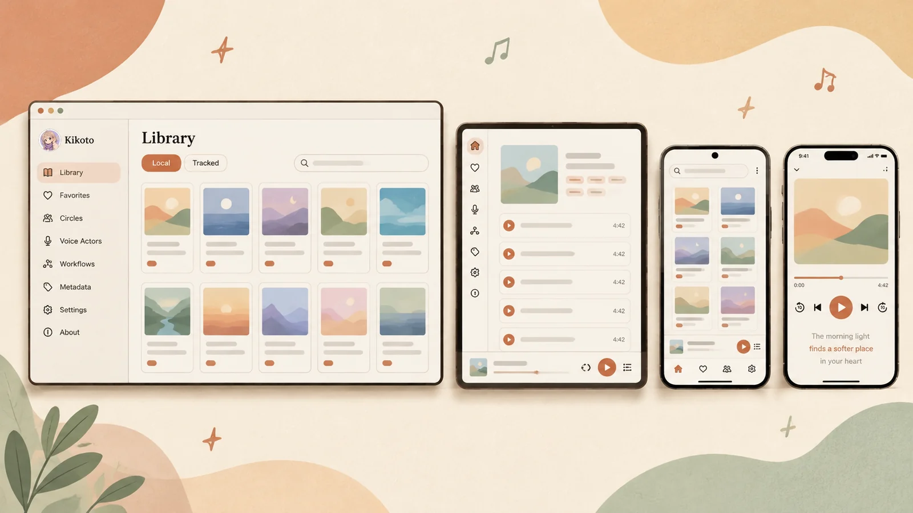
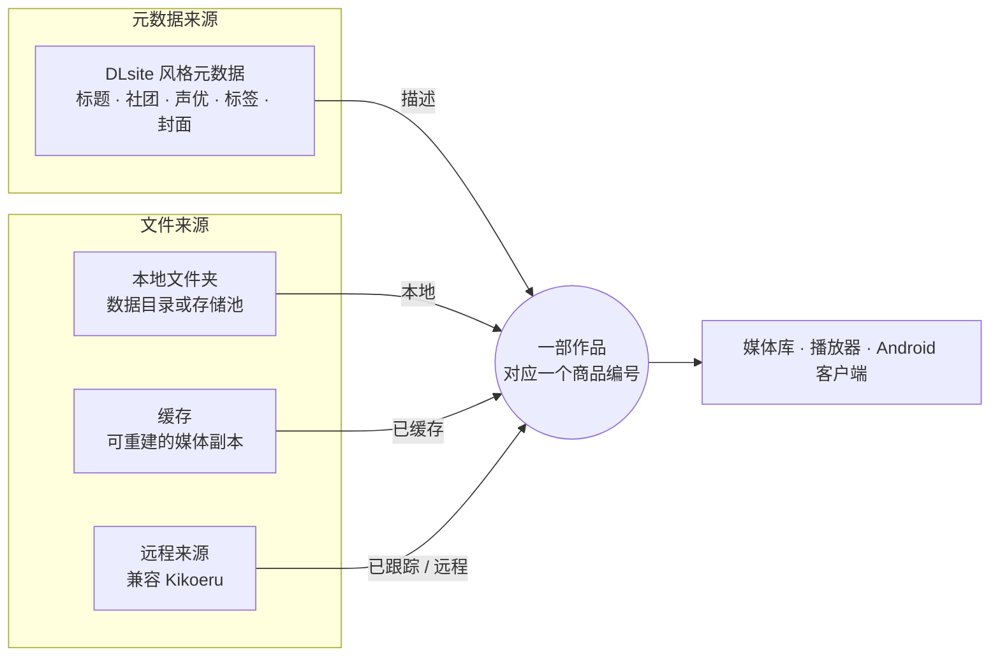

<p align="center">
  <a href="../../README.md">English</a> ·
  <a href="README.zh-Hans.md">简体中文</a> ·
  <a href="README.zh-Hant.md">繁體中文</a> ·
  <a href="README.ja.md">日本語</a> ·
  <a href="README.ko.md">한국어</a>
</p>

<p align="center">
  
</p>

<h1 align="center">Kikoto</h1>

<p align="center">
  <b>你购买的音频作品，无论来自哪个文件夹、缓存或来源，都汇集在同一个媒体库中。</b><br>
  本地优先、可自托管的音频媒体库、来源浏览器和播放器。
</p>

<p align="center">
  <a href="https://github.com/yexca/kikoto/releases"></a>
  <a href="https://kikoto.yexca.net"></a>
  <a href="https://hub.docker.com/r/yexca/kikoto"></a>
  <a href="../../LICENSE"></a>
</p>

<p align="center">
  <a href="#快速开始">快速开始</a> ·
  <a href="#亮点">亮点</a> ·
  <a href="#工作原理">工作原理</a> ·
  <a href="#文档">文档</a> ·
  <a href="#免责声明">免责声明</a>
</p>

Kikoto 将 DLsite 风格的元数据、本地文件夹、可重建的缓存以及兼容 Kikoeru 的远程文件来源，统一到**同一个作品模型**之下。无论文件存放在哪里，一部作品在你的媒体库中始终只是一个条目。Kikoto 以自托管 Web 应用的形式运行，带有响应式播放器，并提供原生 Android 客户端。

<p align="center">
  
</p>

> [!NOTE]
> Kikoto 只是自托管软件，不提供任何服务或内容，仅用于整理和聆听你自己购买的 DLsite 作品。参见[免责声明](#免责声明)。

> [!IMPORTANT]
> Kikoto 正在积极开发中。升级前请备份 `config/`，并在将实例暴露到网络之前，先查看[安全模型](../operations/security.md)。

## 亮点

<table>
  <tr>
    <td width="50%" valign="top">
      <h3>📚 一个媒体库，多处位置</h3>
      本地、缓存、已跟踪和远程的文件，都只是同一部作品的可用状态，而不是各自独立的媒体库条目。可以使用单一的数据目录，也可以把每块磁盘和云盘分别挂载为独立的<b>存储池</b>。
    </td>
    <td width="50%" valign="top">
      <h3>🔎 本地发现</h3>
      扫描受支持的作品编号文件夹，并通过启动时和文件系统触发的工作流保持本地存在信息最新。元数据同步单独运行，仅在你需要补充信息时才执行。
    </td>
  </tr>
  <tr>
    <td width="50%" valign="top">
      <h3>🌐 远程来源</h3>
      浏览兼容的来源，<b>跟踪</b>其目录树，<b>缓存</b>选定的媒体，或将经过审阅的文件<b>获取（Fetch）</b>到你的本地媒体库。
    </td>
    <td width="50%" valign="top">
      <h3>🎧 连贯的聆听体验</h3>
      常驻的播放器，支持队列、歌词、播放速度、睡眠定时器、来源回退、Media Session 和 PWA。浏览页面时播放不会中断。
    </td>
  </tr>
  <tr>
    <td width="50%" valign="top">
      <h3>📱 响应式布局，适配 Android</h3>
      在桌面和手机上使用同一个媒体库，并提供带有原生媒体控制和音频焦点集成的已签名 Android 客户端。
    </td>
    <td width="50%" valign="top">
      <h3>🧭 可检查的后台任务</h3>
      在工作流和活动中跟踪扫描、元数据同步、Fetch、清理、重试和待审候选项。在元数据中处理元数据问题和缺失来源的问题。
    </td>
  </tr>
  <tr>
    <td colspan="2" valign="top">
      <h3>🗂️ 个人状态与管理状态</h3>
      收藏、标签、收听状态、播放进度、文件夹和推荐偏好、角色、来源配置以及缓存策略，全部保存在同一个 SQLite 数据库中。
    </td>
  </tr>
</table>

## 工作原理

元数据来源和文件来源是分开的。元数据描述一部作品；文件来源只说明它的音频可以在哪里找到。两者都附着在同一部作品上，该作品由其商品编号标识。



对于远程来源，**缓存**会在 `/cache` 中保留可重建的副本，**获取**（Fetch）则会把经过审阅的文件发布到本地文件夹。无论哪种方式，文件都会附着到已有的作品上，而不会创建新的作品。

更多内容请参阅[核心边界](../architecture/core-boundaries.md)和 [ADR-0001：统一作品模型](../decisions/ADR-0001-unified-work-model.md)。

## 快速开始

你需要安装带有 Docker Compose 的 Docker。Windows 用户也可以改用[引导式辅助脚本](#windows-辅助脚本)。

**1. 准备部署目录。**把 [`docker-compose.yml`](../../docker-compose.yml) 放到一个空目录中，并创建三个运行时目录：

```sh
mkdir config cache data
```

**2. 添加本地媒体。**把受支持的作品文件夹放到 `data/` 下。[用户指南](../user/index.md)介绍了媒体库布局、扫描规则和存储池。

**3. 启动 Kikoto。**

```sh
docker compose up -d
```

**4. 创建管理员。**打开 <http://127.0.0.1:7655>。首次启动时，Kikoto 会显示**设置 Kikoto**。输入一次性初始化令牌，然后选择管理员的用户名和密码。令牌会输出在服务日志中，并保存为 `config/setup-token`：

```sh
docker compose logs kikoto
```

令牌仅在第一个管理员创建之前有效。不需要预先设置任何密码。如果想改为在 `.env` 中定义 root 账户，请设置 `KIKOTO_ROOT_ACCOUNT_MODE=environment` 以及 `KIKOTO_ROOT_PASSWORD`。这两种方式以及忘记密码后的重置方法，请参阅[管理员初始化与恢复](../operations/security.md#administrator-setup-and-recovery)。

**5. 设置媒体库。**登录后，**设置媒体库**会让你选择普通布局或存储池布局，运行首次扫描，并可选择启动元数据同步。参见[入门指南](../user/zh-Hans/getting-started.md#首次设置媒体库)。

> [!WARNING]
> 默认的端口映射会监听主机的所有网络接口。如果实例不应被周围的网络访问，请把它绑定到回环地址、使用可信的 VPN，或配置受保护的反向代理。部署选项（包括隔离的只读演示部署）请参阅 [Docker](../operations/docker.md) 和[安全](../operations/security.md)。

生产环境的 Compose 部署在同一个主机端口 `7655` 上提供 Web 应用和 API。端口 `7659` 仅由开发环境的部署单独暴露。生产实例默认需要登录；超级管理员可以在 `设置 -> 用户 -> 实例访问` 下选择性地启用只读的匿名媒体库浏览和播放。

已签名的 Android APK 和未签名的 iOS IPA 会附在每个 [GitHub Release](https://github.com/yexca/kikoto/releases) 中。IPA 必须先由侧载工具重新签名，iOS 才会安装。

### 可选设置

可选设置（包括镜像、扫描深度、Cookie 安全性和容器路径）请参阅 [`.env.example`](../../.env.example)。Compose 会自动读取 `.env`；shell 环境变量优先。默认值以及如何应用更改，请参阅 [Compose 配置](../operations/docker.md#configure-with-env)。

### Windows 辅助脚本

在 Windows 上，把 [`kikoto-helper.cmd`](../../kikoto-helper/kikoto-helper.cmd) 放到部署文件夹中并运行。它会以英语或简体中文引导你完成设置。

<details>
<summary>辅助脚本的功能</summary>

<br>

第一个界面用于选择英语或简体中文，并且只会在该命令文件旁边下载所选语言的辅助脚本。随后它会检查 Docker Desktop，下载当前的 Compose 文件，创建运行时目录，支持在浏览器中设置管理员，管理额外的媒体文件夹映射，并提供启动、停止、升级、状态、日志和配置备份等操作。重复运行时会保留已有的 `.env` 和 Compose 文件；旧版 Compose 的账户设置会通过副本更新，并且会先保存原始文件的副本。

辅助脚本会自动准备缺失的部署文件。新安装在浏览器中创建管理员，不需要在 `.env` 中设置密码。由辅助脚本管理的现有账户保持环境模式；更改它们的密码可能会重新创建服务以应用新配置。仅重启不会重新加载 `.env`。“升级”和“备份”会把 `config/` 和部署设置保存到部署目录之外；已挂载的 `data/` 不会被复制。服务管理还提供显式的重新创建、删除容器以及本地镜像版本。删除容器会保留主机挂载的文件。

文件夹管理需要 Docker Compose 2.24.4 或更高版本。单文件夹模式会把所选目录挂载到 `/data`。多文件夹模式会为下载保留位于 `/data` 的主机 `data/` 挂载，并且只在其下挂载所选目录；它不会创建持久卷。“其他 → 多文件夹修复”操作会为旧版辅助脚本创建的部署恢复该主机挂载。

</details>

## 运行时数据

| 主机路径 | 容器路径 | 用途 | 是否备份？ |
| --- | --- | --- | --- |
| `./config` | `/config` | SQLite 状态和可选的首次运行来源配置 | 是 |
| `./data` | `/data` | 原始媒体、已获取的媒体，以及持久的 Fetch 审阅/回滚状态 | 是 |
| `./cache` | `/cache` | 可重建的封面和媒体缓存 | 通常不需要 |

请勿提交这些运行时目录中的任何一个。它们可能包含私人媒体、账户状态、来源端点、工作流诊断信息或凭据。

## 升级

升级前请备份 `config/`，并保留现有的 `data/` 挂载。然后运行：

```sh
docker compose up -d
```

`docker compose up -d` 使用 Compose 默认的拉取策略，即拉取缺失的镜像，并始终拉取 `latest` 标签。`docker compose restart` 则沿用当前的容器镜像。若要获得可复现的部署，请在 `.env` 中把 `KIKOTO_IMAGE` 设置为经过审阅的发布标签或镜像摘要，并在升级时有意地更新它。现有数据库会在启动时迁移，绝不会从全新安装的基线重建。参见[升级](../operations/docker.md#upgrade)和[发布历史](../history/index.md)。

> [!NOTE]
> **自定义工作流编辑功能已被移除。**工作流现在是内置的预设（关注社团、关注系列、关注声优）。当旧数据库通过迁移 035 升级时，Kikoto 会保存用户创建的定义和触发器以供审阅。与预设完全匹配的项可以转换为已停用的触发器；其他定义可以导出。运行历史仍可在“活动”中查看。已经通过迁移 035 的实例，需要使用较早的数据库备份，才能恢复在这次变更之前被删除的定义。

## 文档

| 目标 | 从这里开始 |
| --- | --- |
| 使用 Kikoto：媒体库、来源、播放、工作流、设置 | [用户指南](../user/index.md) |
| 安装并扫描第一个媒体库 | [入门指南](../user/zh-Hans/getting-started.md) |
| 了解用户可见的行为 | [产品规格](../user/zh-Hans/index.md) |
| 配置和运维实例 | [运维](../operations/configuration.md) |
| 了解数据和系统边界 | [架构](../architecture/index.md) |
| 查看设计和安全约定 | [设计](../development/design.md) · [安全](../../SECURITY.md) · [隐私](../../PRIVACY.md) |
| 查找所有公开文档 | [文档索引](../README.md) |

## 开发与贡献

开发环境搭建、验证命令、迁移和发布流程都位于 `docs/development/` 下，因此本 README 可以专注于安装和产品行为。

- [本地开发](../development/local-dev.md)
- [测试](../development/testing.md)
- [贡献指南](../../CONTRIBUTING.md)
- [Agent 指南](../../AGENTS.md)

## 安全与隐私

生产实例默认需要登录。当超级管理员启用匿名访问后，任何能够访问该实例的人都可以浏览媒体库和播放，这是有意为之；变更操作以及个人或管理状态仍需要认证。如果收藏本身必须保持私密，请使用网络层面的控制。若怀疑存在漏洞，请通过 [SECURITY.md](../../SECURITY.md) 中的私密流程报告，并在分享日志或诊断信息之前先查看 [PRIVACY.md](../../PRIVACY.md)。

## 免责声明

- Kikoto 只是软件。本项目不运营商店、流媒体或内容服务，也不托管、销售、提供或分发音频作品、元数据或媒体文件。
- Kikoto 仅用于整理和播放你本人购买的 DLsite 作品。请仅在你有权使用的媒体上使用它，并遵守你所连接的商店和来源的条款。
- 公开演示仅用于展示该软件，并且只显示适合所有年龄段且永久免费的作品。
- Kikoto 是一个独立项目，与 DLsite 或 Kikoeru 没有隶属关系，也未获得它们的认可。文中使用它们的名称仅是为了说明兼容性。
- 每个实例都由其所有者运营，所有者对其配置所使用的来源以及添加到其中的文件负责。

## 许可证

版权所有 (C) 2026 yexca。Kikoto 是依据 [GNU Affero General Public License v3.0](../../LICENSE) 授权的自由软件，不提供任何担保。
