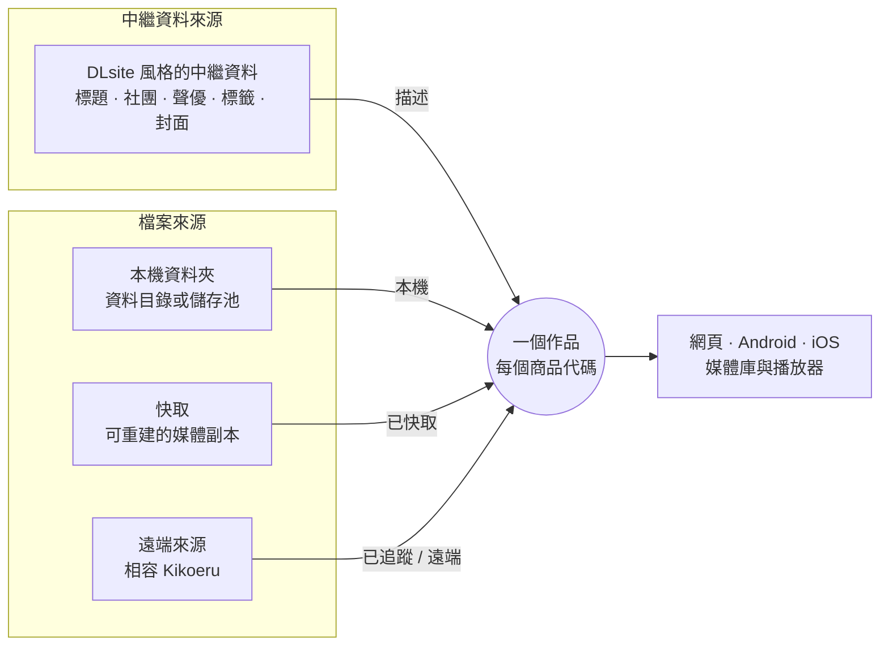

<p align="center">
  <a href="../../README.md">English</a> ·
  <a href="README.zh-Hans.md">简体中文</a> ·
  <a href="README.zh-Hant.md">繁體中文</a> ·
  <a href="README.ja.md">日本語</a> ·
  <a href="README.ko.md">한국어</a>
</p>

<p align="center">
  
</p>

<h1 align="center">Kikoto</h1>

<p align="center">
  <b>你購買的音訊作品，無論來自哪個資料夾、快取或來源，都集中在同一個媒體庫。</b><br>
  本機優先、可自行架設的音訊媒體庫、來源瀏覽器與播放器。
</p>

<p align="center">
  <a href="https://github.com/yexca/kikoto/releases"></a>
  <a href="https://kikoto.yexca.net"></a>
  <a href="https://hub.docker.com/r/yexca/kikoto"></a>
  <a href="../../LICENSE"></a>
</p>

<p align="center">
  <a href="#特色亮點">特色亮點</a> ·
  <a href="#支援平台">支援平台</a> ·
  <a href="#運作方式">運作方式</a> ·
  <a href="#快速開始">快速開始</a> ·
  <a href="#文件">文件</a> ·
  <a href="#免責聲明">免責聲明</a>
</p>

Kikoto 將 DLsite 風格的中繼資料、本機資料夾、可重建的快取，以及相容 Kikoeru 的遠端檔案來源，整合在**單一統一的作品模型**之下。無論檔案存放在哪裡，一個作品在你的媒體庫中都只會是一筆項目。Kikoto 以可自行架設的網頁應用程式形式執行，附有常駐的播放器，同一個媒體庫可在桌面瀏覽器、平板，以及 Android 與 iOS 應用程式中開啟。

<p align="center">
  
</p>

> [!NOTE]
> Kikoto 僅是可自行架設的軟體。它不提供任何服務或內容，其設計目的僅是整理並聆聽你自己購買的 DLsite 作品。請參閱[免責聲明](#免責聲明)。

> [!IMPORTANT]
> Kikoto 仍在積極開發中。升級前請備份 `config/`，並在將執行個體暴露到網路之前，先閱讀[安全模型](../operations/security.md)。

## 特色亮點

<table>
  <tr>
    <td width="50%" valign="top">
      <h3>📚 一個媒體庫，多個位置</h3>
      本機、快取、已追蹤與遠端的檔案，都只是同一個作品的可用狀態，而不是各自獨立的媒體庫項目。可以使用單一資料目錄，也可以把每顆磁碟與雲端硬碟各自掛載為一個<b>儲存池</b>。
    </td>
    <td width="50%" valign="top">
      <h3>🌐 遠端來源</h3>
      瀏覽相容的來源、<b>追蹤</b>它們的目錄樹、<b>快取</b>選定的媒體，或將經過審核的檔案<b>取得</b>到你的本機媒體庫。遠端操作各自有獨立的權限。
    </td>
  </tr>
  <tr>
    <td width="50%" valign="top">
      <h3>🏷️ 以你的語言呈現中繼資料</h3>
      標題、共用標籤、社團與聲優都依語言各自記錄名稱，每位使用者可以選擇偏好的中繼資料語言。編輯者可以逐一作品修正標題、封面、標籤與製作名單。
    </td>
    <td width="50%" valign="top">
      <h3>🔎 本機探索</h3>
      掃描受支援的作品代碼資料夾，並透過啟動時與檔案系統觸發的工作流程，讓本機存在狀態保持最新。中繼資料同步則獨立執行，只在你想要補充資料時才進行。
    </td>
  </tr>
  <tr>
    <td width="50%" valign="top">
      <h3>🎧 連續的聆聽體驗</h3>
      常駐的播放器，具備佇列、播放速度、睡眠計時器、來源後備與 Media Session。播放進度會跟著你的帳戶在各個裝置間同步，收聽儀表板則會顯示總計、連續天數與最常播放的作品。
    </td>
    <td width="50%" valign="top">
      <h3>💬 歌詞</h3>
      LRC、WebVTT 與 SRT 歌詞會在播放器與螢幕歌詞視窗中跟隨播放。<b>管理歌詞</b>可為每個音軌指派歌詞檔案，也能從遠端來源下載歌詞。
    </td>
  </tr>
  <tr>
    <td width="50%" valign="top">
      <h3>✨ 看得懂的推薦</h3>
      分數在你自己的執行個體上，依據你的收藏與聆聽紀錄計算，顯示於本機與遠端作品，並逐項說明各個分數的由來。
    </td>
    <td width="50%" valign="top">
      <h3>🧭 可檢視的背景工作</h3>
      在工作流程與活動中追蹤掃描、中繼資料同步、取得、可用性監視、清理、重試與待審核的候選項目。在中繼資料中處理中繼資料與缺少來源的問題。
    </td>
  </tr>
  <tr>
    <td colspan="2" valign="top">
      <h3>🗂️ 帳戶、角色與單一資料庫</h3>
      使用者、貢獻者、管理員與超級管理員等角色，決定誰能瀏覽、取得、編輯與管理。收藏、標籤、收聽狀態、播放進度、偏好設定、來源設定與快取原則，全都存放在同一個 SQLite 資料庫中。
    </td>
  </tr>
</table>

## 支援平台

一台伺服器服務所有螢幕，在頁面之間切換時，播放器也會持續播放。

| 平台 | 你能得到什麼 |
| --- | --- |
| **寬版網頁**（桌面瀏覽器） | 完整版面：側邊欄導覽、多欄的媒體庫，以及作品詳細資料頁中位於音軌清單旁的資料夾瀏覽器。 |
| **窄版網頁**（平板或小視窗） | 以精簡版面呈現相同的頁面，控制項大小適合觸控操作。網頁應用程式可安裝為 PWA。 |
| **Android** | 經過簽署的 APK，具備媒體通知、浮動歌詞、音訊焦點處理，以及包含應用程式鎖在內的裝置隱私控制。 |
| **iOS** | 供側載的未簽署 IPA，具備子母畫面歌詞、邊緣滑動返回、儲存在 Keychain 中的工作階段，以及裝置隱私控制。 |

APK 與 IPA 附加在每個 [GitHub Release](https://github.com/yexca/kikoto/releases) 上。側載工具會先用你自己的 Apple 帳號重新簽署 IPA，iOS 才會安裝它。兩個應用程式都是連線到你自己的 Kikoto 伺服器；請參閱[快速開始](../user/zh-Hant/getting-started.md#android-用戶端)。

## 運作方式

中繼資料來源與檔案來源是分開的。中繼資料描述一個作品；檔案來源只說明它的音訊可以在哪裡找到。兩者都附加到同一個作品上，並以其商品代碼識別。



對於遠端來源，**快取**會在 `/cache` 中保留可重建的副本，而**取得**則會把經過審核的檔案發佈到本機資料夾。無論哪一種，檔案都是附加到既有的作品，而不是建立新作品。

詳情請參閱[核心邊界](../architecture/core-boundaries.md)與 [ADR-0001：統一作品模型](../decisions/ADR-0001-unified-work-model.md)。

## 快速開始

你需要安裝了 Docker Compose 的 Docker。Windows 使用者也可以改用[引導式輔助工具](#windows-輔助工具)。

**1. 準備部署目錄。** 將 [`docker-compose.yml`](../../docker-compose.yml) 放進一個空目錄，並建立三個執行階段目錄：

```sh
mkdir config cache data
```

**2. 加入本機媒體。** 將受支援的作品資料夾放在 `data/` 之下。[使用者指南](../user/index.md)說明媒體庫配置、掃描規則與儲存池。

**3. 啟動 Kikoto。**

```sh
docker compose up -d
```

**4. 建立管理員。** 開啟 <http://127.0.0.1:7655>。首次啟動時，Kikoto 會顯示 **設定 Kikoto**。輸入一次性的設定權杖，然後選擇管理員的使用者名稱與密碼。權杖會輸出在服務日誌中，並儲存為 `config/setup-token`：

```sh
docker compose logs kikoto
```

此權杖只在第一位管理員建立之前有效。不會事先設定任何密碼。若想改為在 `.env` 中定義 root 帳戶，請設定 `KIKOTO_ROOT_ACCOUNT_MODE=environment` 與 `KIKOTO_ROOT_PASSWORD`。兩種做法以及重設忘記的密碼，請參閱[管理員初始設定與復原](../operations/security.md#administrator-setup-and-recovery)。

**5. 設定你的媒體庫。** 登入後，**設定媒體庫** 讓你選擇一般或儲存池配置、執行首次掃描，並可選擇啟動中繼資料同步。請參閱[快速開始](../user/zh-Hant/getting-started.md#首次媒體庫設定)。

> [!WARNING]
> 預設的連接埠對應會監聽每個主機網路介面。若執行個體不應從周遭網路連線，請將它綁定到回送位址、使用受信任的 VPN，或設定受保護的反向代理。部署選項（包括隔離的唯讀示範堆疊）請參閱 [Docker](../operations/docker.md) 與[安全性](../operations/security.md)。

正式環境的 Compose 堆疊在同一個主機連接埠 `7655` 上提供網頁應用程式與 API。連接埠 `7659` 只由開發堆疊另外對外開放。正式環境的執行個體預設需要登入；超級管理員可選擇在 `設定 -> 使用者 -> 執行個體存取權` 之下，啟用唯讀的匿名媒體庫瀏覽與播放。

### 選用設定

選用設定（包括映像檔、掃描深度、Cookie 安全性與容器路徑）請參閱 [`.env.example`](../../.env.example)。Compose 會自動讀取 `.env`；shell 環境變數的優先順序較高。預設值以及如何套用變更，請參閱 [Compose 設定](../operations/docker.md#configure-with-env)。

### Windows 輔助工具

在 Windows 上，將 [`kikoto-helper.cmd`](../../kikoto-helper/kikoto-helper.cmd) 放進部署資料夾並執行。它會以英文或簡體中文引導你完成設定。

<details>
<summary>輔助工具會做什麼</summary>

<br>

第一個畫面會選擇英文或簡體中文，並只把所選語言的輔助工具下載到該命令檔旁邊。接著它會檢查 Docker Desktop、下載目前的 Compose 檔案、建立執行階段目錄、支援在瀏覽器中設定管理員、管理額外的媒體資料夾對應，並提供啟動、停止、升級、狀態、日誌與設定備份等操作。重新執行時會保留既有的 `.env` 與 Compose 檔案；舊版 Compose 帳戶設定會更新，並事先儲存原始檔案的副本。

輔助工具會自動準備缺少的部署檔案。全新安裝會在瀏覽器中建立管理員，不需要 `.env` 密碼。由輔助工具管理的既有帳戶會保留環境模式；它們的密碼變更可能會重新建立服務以套用新設定。單純重新啟動並不會重新載入 `.env`。升級與備份會把 `config/` 與部署設定儲存到部署目錄之外；掛載的 `data/` 不會被複製。服務管理也提供明確的重新建立、移除容器，以及本機映像檔版本。移除容器會保留主機掛載的檔案。

資料夾管理需要 Docker Compose 2.24.4 或更新版本。單一資料夾模式會把所選目錄掛載在 `/data`。多資料夾模式則為了下載而將主機的 `data/` 掛載保留在 `/data`，並只把所選目錄掛載到它之下；它不會建立任何持久性磁碟區。「其他 → 多資料夾修復」操作會為由舊版輔助工具建立的部署，還原該主機掛載。

</details>

## 執行階段資料

| 主機路徑 | 容器路徑 | 用途 | 需要備份？ |
| --- | --- | --- | --- |
| `./config` | `/config` | SQLite 狀態與選用的首次執行來源設定 | 是 |
| `./data` | `/data` | 原始媒體、取得的媒體，以及持久的取得審核／復原狀態 | 是 |
| `./cache` | `/cache` | 可重建的封面與媒體快取 | 通常不需要 |

請勿提交這些執行階段目錄中的任何內容。它們可能包含私人媒體、帳戶狀態、來源端點、工作流程診斷資料或憑證。

## 升級

升級前請備份 `config/`，並保留既有的 `data/` 掛載。然後執行：

```sh
docker compose up -d
```

`docker compose up -d` 使用 Compose 預設的拉取原則，會拉取缺少的映像檔，並且一律拉取 `latest` 標籤。`docker compose restart` 則沿用目前的容器映像檔。若需要可重現的部署，請在 `.env` 中將 `KIKOTO_IMAGE` 設為經過審查的發佈標籤或映像檔摘要，並在升級時刻意更新它。既有的資料庫會在啟動時遷移，絕不會從全新安裝的基準重建。請參閱[升級](../operations/docker.md#upgrade)與[發佈歷史](../history/index.md)。

## 文件

| 目標 | 從這裡開始 |
| --- | --- |
| 使用 Kikoto：媒體庫、來源、播放、工作流程、設定 | [使用者指南](../user/index.md) |
| 安裝並掃描第一個媒體庫 | [快速開始](../user/zh-Hant/getting-started.md) |
| 了解使用者可見的行為 | [產品規格](../user/zh-Hant/index.md) |
| 設定並維運執行個體 | [維運](../operations/configuration.md) |
| 了解資料與系統邊界 | [架構](../architecture/index.md) |
| 檢視設計與安全契約 | [設計](../development/design.md) · [安全性](../../SECURITY.md) · [隱私](../../PRIVACY.md) |
| 尋找所有公開文件 | [文件索引](../README.md) |

## 開發與貢獻

開發環境設定、驗證指令、遷移與發佈程序，都放在 `docs/development/` 之下，讓這份 README 能專注於安裝與產品行為。

- [本機開發](../development/local-dev.md)
- [測試](../development/testing.md)
- [貢獻](../../CONTRIBUTING.md)
- [代理指南](../../AGENTS.md)

## 安全與隱私

正式環境的執行個體預設需要登入。當超級管理員啟用匿名存取時，任何能連到該執行個體的人，都可以刻意公開地瀏覽媒體庫並播放；變更操作以及個人或管理狀態仍然需要驗證。若收藏本身必須保持私密，請使用網路控管。如發現疑似安全漏洞，請透過 [SECURITY.md](../../SECURITY.md) 中的私下流程回報，並在分享日誌或診斷資料之前，先閱讀 [PRIVACY.md](../../PRIVACY.md)。

## 免責聲明

- Kikoto 僅是軟體。本專案不營運商店、串流或內容服務，也不代管、販售、提供或散布音訊作品、中繼資料或媒體檔案。
- Kikoto 的設計目的僅是整理並播放你本人購買的 DLsite 作品。請僅用於你有權使用的媒體，並遵守你所連接的商店與來源的條款。
- 公開示範僅用於展示這套軟體，只會顯示全年齡且永久免費的作品。
- Kikoto 是獨立專案，與 DLsite 或 Kikoeru 沒有隸屬關係，也未獲其背書。提及它們的名稱僅用於說明相容性。
- 每個執行個體都由其擁有者營運，擁有者須對其設定使用的來源以及加入的檔案負責。

## 授權

Copyright (C) 2026 yexca. Kikoto 是依 [GNU Affero General Public License v3.0](../../LICENSE) 授權的自由軟體，且不附帶任何保證。
